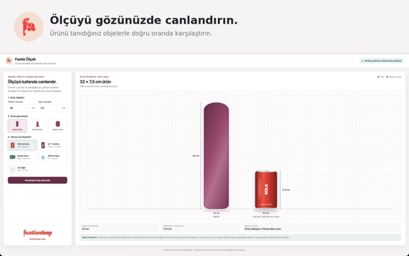

# Fastie Ölçek

Fastie Ölçek, ürün ölçülerini günlük hayattan tanıdığınız nesnelerle **aynı matematiksel ölçekte** yan yana gösteren ücretsiz bir tarayıcı uzantısıdır. Uzunluk ve çap/genişlik değerlerini girerek ölçü farkını daha kolay canlandırabilirsiniz.

[Chrome için edinin](https://chromewebstore.google.com/detail/naipbaoidoagbbamcljejgjnholbddpa) · [Edge için edinin](https://microsoftedge.microsoft.com/addons/detail/jlmbocielopnmeiipjmcggklfgjecoge) · [Firefox için edinin](https://addons.mozilla.org/addon/fastie-olcek/) · [Fastieshop'u ziyaret edin](https://www.fastieshop.com/) · [Telegram duyuru kanalı](https://t.me/fastieshopcom)

## Neler yapar?

- Girdiğiniz ürün ölçülerini seçtiğiniz referans nesneyle aynı ölçekte çizer.
- Uzun, konik ve geniş ürün görünümleri sunar.
- Ürün ile referans nesne arasındaki yükseklik oranını hesaplar.
- Son tercihlerinizi yalnızca tarayıcınızdaki yerel depolamada saklar.

## Neler yapmaz?

Fastie Ölçek otomatik ürün taraması, fiyat karşılaştırması veya satın alma işlemi yapmaz. Ekrandaki çizim fiziksel bir cetvel değildir; iki nesne arasındaki oransal boyut farkını görselleştirir.


Ambalaj ve cihaz ölçüleri modele ya da markaya göre küçük farklılıklar gösterebilir. Kesin ürün bilgisi için üreticinin ölçülerini esas alın.


## Dokümantasyon

- [Başlangıç](docs/baslangic.md)
- [Nasıl çalışır?](docs/nasil-calisir.md)
- [Referans nesneler](docs/referans-nesneler.md)
- [Gizlilik](docs/gizlilik.md)
- [Sık sorulan sorular](docs/sss.md)
- [Destek](docs/destek.md)
